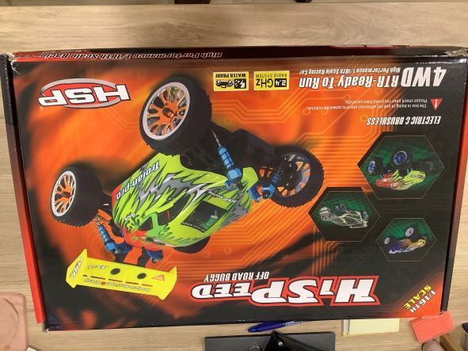
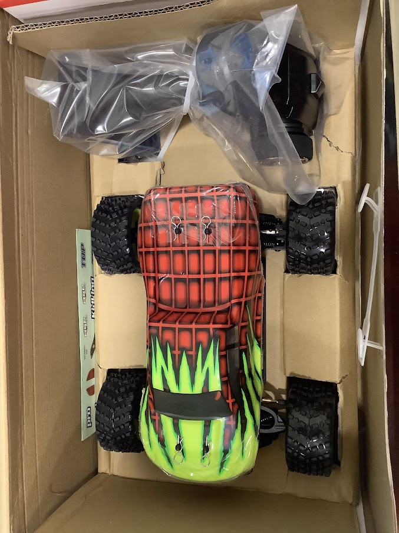
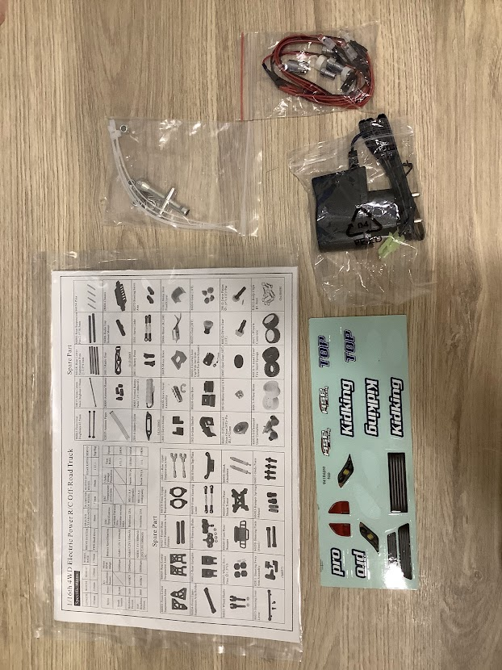
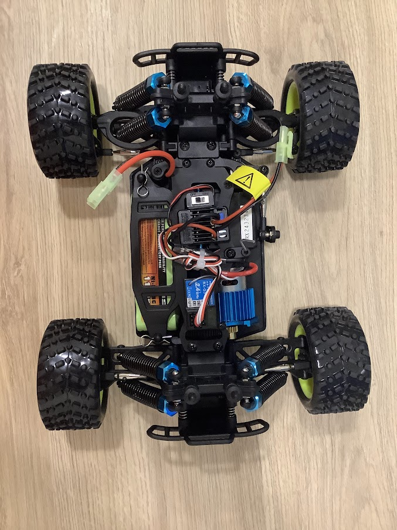
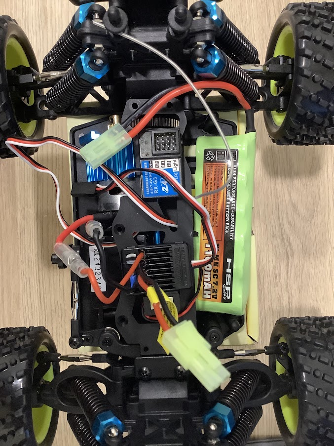
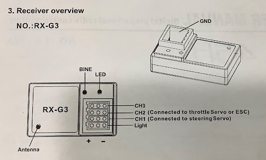
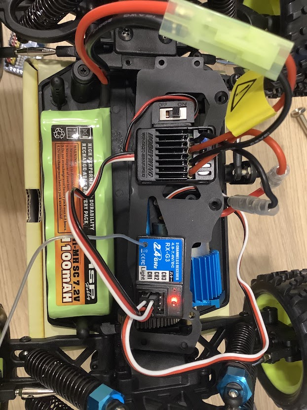

參考官方文件支援 HSP 94186 這台遙控車，某寶上也找的到，於是就訂了這款，要注意 HSP 94186 有三個型號，要選有刷版本的，因為不用跑那麼快，價格也便宜一點

2023-02-07 收到車了

## 開箱

## 電子零件

電子零件有

- 鎳錳電池(Ni-MH SC 7.2V 1100mAH): SC 是電池的型號，比三號電池矮胖
- 2.4 GHz 接收器(RX-G3)
- 好盈電子調速器/ESC(QuicRun WP 1625 Brushed)
- 馬達(RC380)
- 伺服馬達(6kg)

## 原始接線

原始的接線是電池供電給 ESC，ESC 上有 BEC 的線性穩壓輸出(6V/1A)，接收器跟伺服馬達的電源都來自 BEC，ESC 有兩條線接到馬達(當然，因為 ESC 就是用來控制馬達的)，ESC 的輸入是 PWM，訊號來自於接受器，所以把 BEC 的電源兩條線跟訊號線接到接收器的 CH2，應該是因為遙控器控制 ESC 是設定在 CH2，所以這邊要接 CH2，可以參考接收器的說明書，伺服馬達的三條線接到伺服馬達的 CH1，因為接收器上的所有 + 跟所以 - 都是分別連通的，所以就能使用 BEC 的電源了

待補充: 因為我手邊沒有四顆三號(AA)電池，所以還沒辦法用遙控器來控制車子
