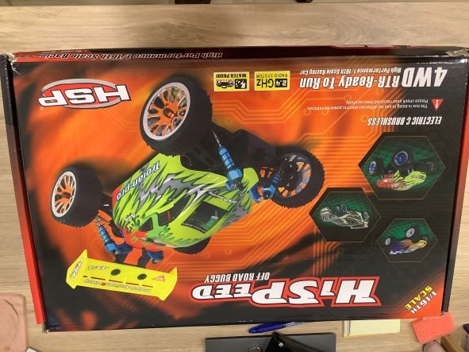
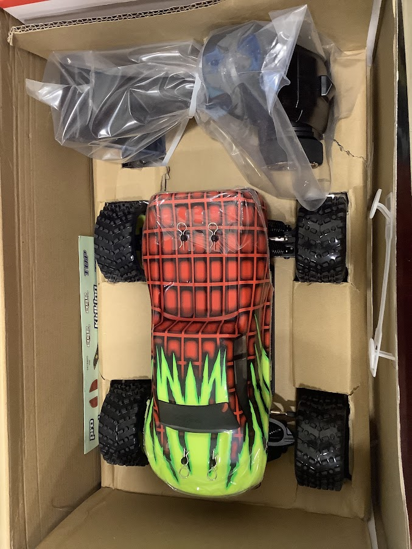
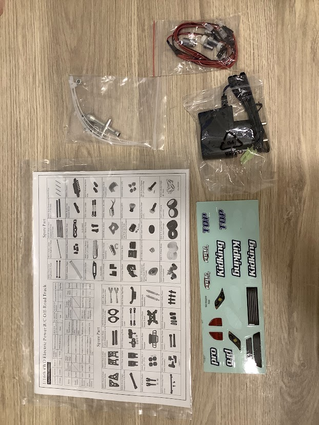
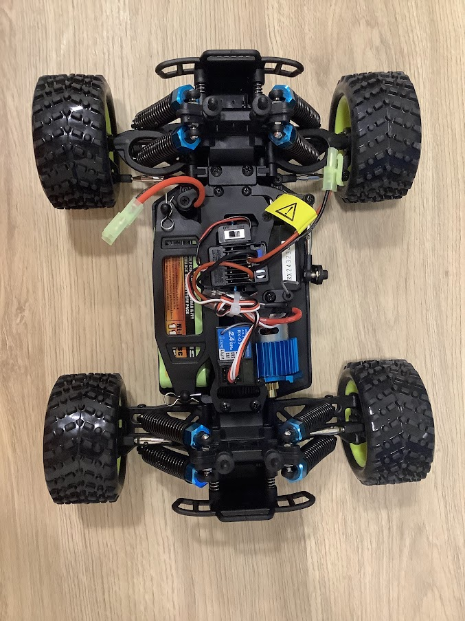
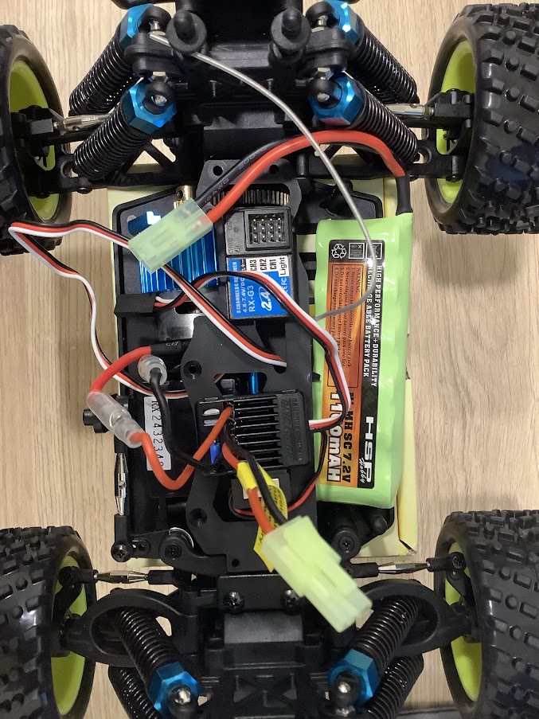
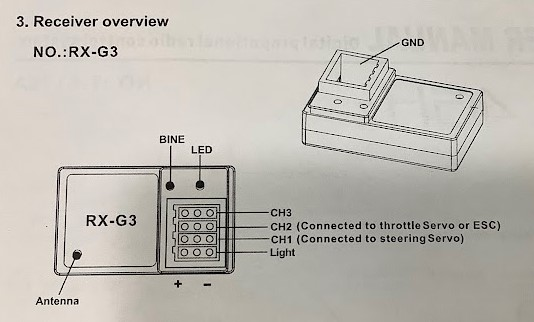
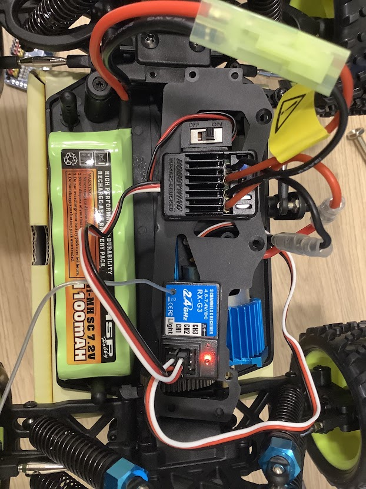

# 收到遙控車了

參考官方文件支援 HSP 94186 這台遙控車，某寶上也找的到，於是就訂了這款，要注意 HSP 94186 有三個型號，要選有刷版本的，因為不用跑那麼快，價格也便宜一點

2023-02-07 收到車了

## 開箱

## 電子零件

電子零件有

- 鎳錳電池(Ni-MH SC 7.2V 1100mAH): SC 是電池的型號，比三號電池矮胖
- 2.4 GHz 接收器(RX-G3)
- 好盈電子調速器/ESC(QuicRun WP 1625 Brushed)
- 馬達(RC380)
- 伺服馬達(6kg)

## 原始接線

原始的接線是電池供電給 ESC，ESC 上有 BEC 的線性穩壓輸出(6V/1A)，接收器跟伺服馬達的電源都來自 BEC，ESC 有兩條線接到馬達(當然，因為 ESC 就是用來控制馬達的)，ESC 的輸入是 PWM，訊號來自於接受器，所以把 BEC 的電源兩條線跟訊號線接到接收器的 CH2，應該是因為遙控器控制 ESC 是設定在 CH2，所以這邊要接 CH2，可以參考接收器的說明書，伺服馬達的三條線接到伺服馬達的 CH1，因為接收器上的所有 + 跟所以 - 都是分別連通的，所以就能使用 BEC 的電源了

## 遙控器

遙控器需要四顆三號(AA)電池，有附一張說明書，文中提到開遙控器開啟之後才把接收器打開，要關閉的時候要先關接收器再關遙控器的開關，應該是為了確保接收器收到正確的訊號，操控時要後退時遙控器需要後退第一次，第二次車子才會真的後退，我猜這是 ESC 特別的設計，但 ESC 的說明書沒有提到這件事，donkey car 的文件中確實也提到這件事 [Reverse on RC cars is a little tricky...](https://docs.donkeycar.com/guide/calibrate/#:~:text=Reverse%20on%20RC%20cars%20is%20a%20little%20tricky%20because%20the%20ESC%20must%20receive%20a%20reverse%20pulse%2C%20zero%20pulse%2C%20reverse%20pulse%20to%20start%20to%20go%20backwards.%20To%20calibrate%20a%20reverse%20PWM%20setting)，到這邊就可以確定車子本身沒有問題
