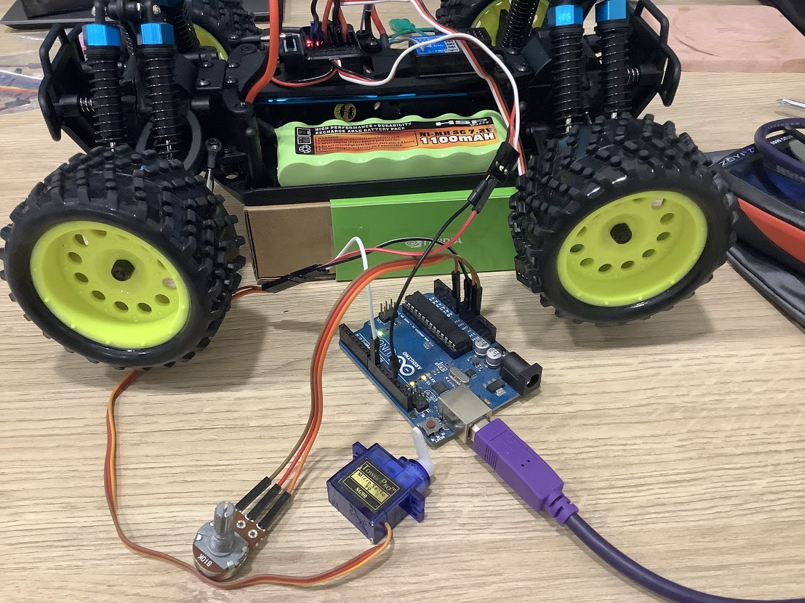
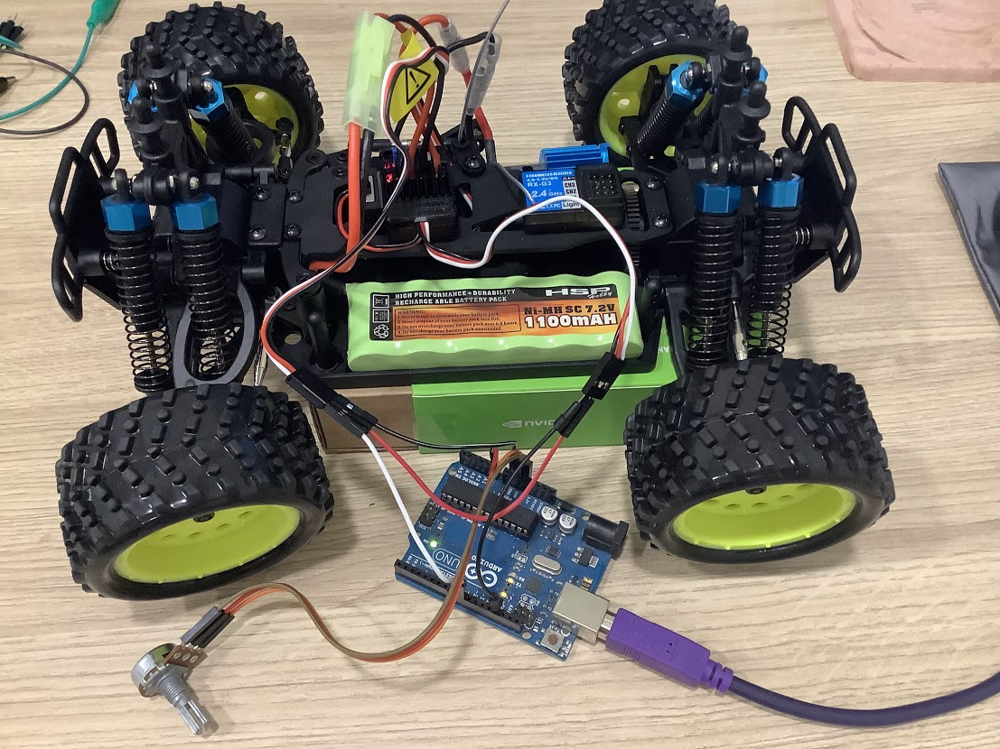

## 怎麽讓車子動起來

大概看了官方的組裝影片會發現這個項目沒有要用 2.4G 的接收器，因為要做的是自動駕駛而不是遙控車，自動駕駛的大腦是 rpi 或是 jetson nano，另外還會用到一個 PCA9685，這個是 16 個通道的伺服馬達控制板，大腦會用 I2C 跟 PCA9685 溝通，就可以控制 16 個伺服馬達了，而本來接在接收器上的各三條線就改接在 PCA9685，我買 HSP 94186 的時候也買了一個，但我還不想用這個板子，我想要先實驗要怎麼用 arduino 控制 ESC 跟 伺服馬達

這裡想到一個問題是為什麼 ESC 也可以接到 PCA9685

## 用 arduino 控制伺服馬達

我先實驗用 arduino 控制伺服馬達的部分，我想 ESC 比較複雜，而且 arduino 網站上就有用 [arduino 控制伺服馬達的教學文件](https://docs.arduino.cc/learn/electronics/servo-motors)


用旋鈕式的可變電阻控制伺服馬達的角度，用 BEC 為 SG90 供電比用 arduino 板子上的電源更安心，SG90 可以轉的角度大概是170度




```
#include <Servo.h>

Servo myservo;  // create servo object to control a servo

int potpin = 0;  // analog pin used to connect the potentiometer
int val;    // variable to read the value from the analog pin

void setup() {
  myservo.attach(9);  // attaches the servo on pin 9 to the servo object
}

void loop() {
  val = analogRead(potpin);            // reads the value of the potentiometer (value between 0 and 1023)
  val = map(val, 0, 1023, 0, 180);     // scale it to use it with the servo (value between 0 and 180)
  myservo.write(val);                  // sets the servo position according to the scaled value
  delay(15);                           // waits for the servo to get there
}
```

換成接到遙控車上的伺服馬達，就可以控制車子的轉向了



## 用 arduino 控制 ESC

