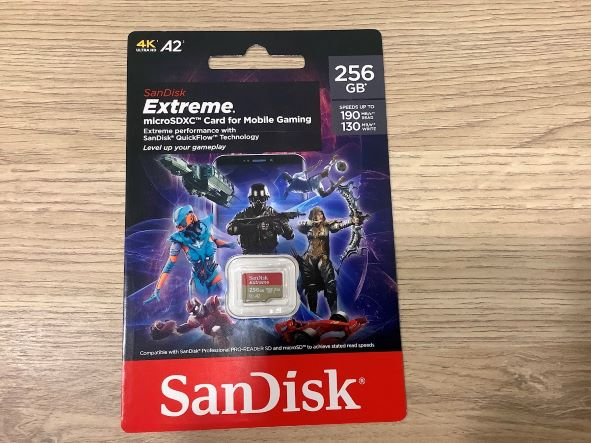
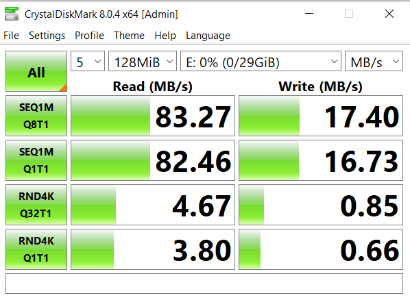
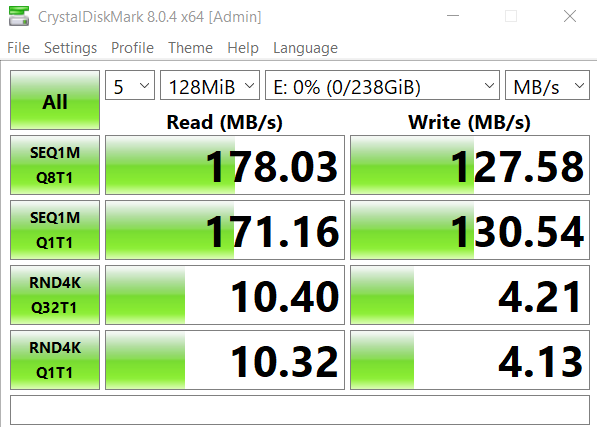
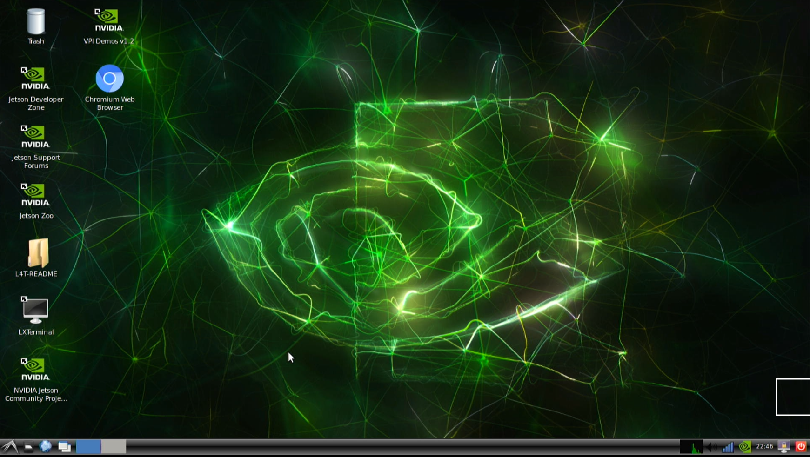

# 安裝軟體

## Jetson Nano

我之前就有買過 Jetson Nano，版本是 Jetson Nano 2GB Developer Kit，但是已經停產了，初始設定就參考官方提供的[教學](https://developer.nvidia.com/embedded/learn/get-started-jetson-nano-2gb-devkit#intro)

## SD 卡

donkey car 文件建議的 SD 卡是讀 190 MB/s, 寫 130 MB/s

這次要做的項目應該會需要快一點的讀寫，所以買一張新的 SD 卡

關於這些數值[這篇](https://forum.gamer.com.tw/C.php?bsn=60030&snA=589710)有討論，但我沒認真看，反正先換好一點的卡

## 安裝作業系統

* 格式化 SD 卡: Windows 上安裝 SD Memory Card Formatter，選擇 SD 卡磁碟，快速格式化, 不用填 Volume label，按下格式化
* 把映像檔寫入 SD 卡: 從網站下載映像檔，安裝 Etcher，選映像檔，選 SD 卡磁碟，按下 Flash

用這張卡燒入 13.8 GB 大概花1.5分鐘而已，驗證大概1分鐘

準備好螢幕跟鍵鼠，Jetson Nano 沒有內建 Wifi 網卡，我是用 usb wifi 網卡，往後也可以考慮買插在板子上的網卡

初次設定也有 headless mode，但我沒有試

步驟就一直往下，沒有做特別的設定

