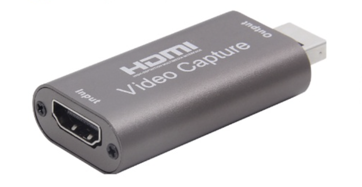

# 常用的工具

## 輸入輸出

### 鍵盤滑鼠

我的桌電是用 logitech 的鍵盤滑鼠，可以用 Unifying 無線接收器，一個接收器可以連六個設備，設備可以設定三組連線連到不同的接受器，所以我是準備兩個接收器，一個接在日常使用的電腦，另一個接在單板電腦上，這樣就不用準備兩套鍵鼠，可以從 logitech 官方去找 unifying 軟體，用這個軟體設定設備跟接收器的配對，目前這個軟體沒有支援 Linux 環境的版本，可以在 Windows 或是 Mac 上設定好，Linux 上有一個開源軟體 solaar 也可以用來設定

### HDMI 影像擷取卡

為了要看到畫面會需要螢幕，雖然設定好 ssh 或是用一些遠端桌面的方式也可以操作單板電腦，但有時候直接看到畫面會更方便，可以用 HDMI 影像擷取卡直接接到電腦



Windows 上可以用內建的相機程式看到 USB Camera 就能看到畫面


## SSH

先用 ifconfig 找到內部 ip

我是用 vscode 開 ssh 連線，新增 ssh USER_NAME@IP，先用密碼登入

為了以後不用打密碼，要生成一組公私鑰，訪問者用公鑰，被訪問者有私鑰

所以 Windows 上要有公鑰，Jetson Nano 上要有私鑰

先在 Windows 上生成一對公私鑰(也可以用現有的)

```
$ mkdir ~/.ssh

$ cd ~/.ssh

$ ssh-keygen
```

都按 Enter 會產生 id_rsa, id_rsa.pub (如果有另外命名，可以用 ~/.ssh/config 設定)

把私鑰內容複製起來

到 Jetson Nano 上的 ~/.ssh/authorized_keys 貼上內容 (需要自己新增這個資料夾跟檔案)

接下來就可以不用密碼了

如果想要更安全，也可以設定 ssh 不允許使用密碼登入
