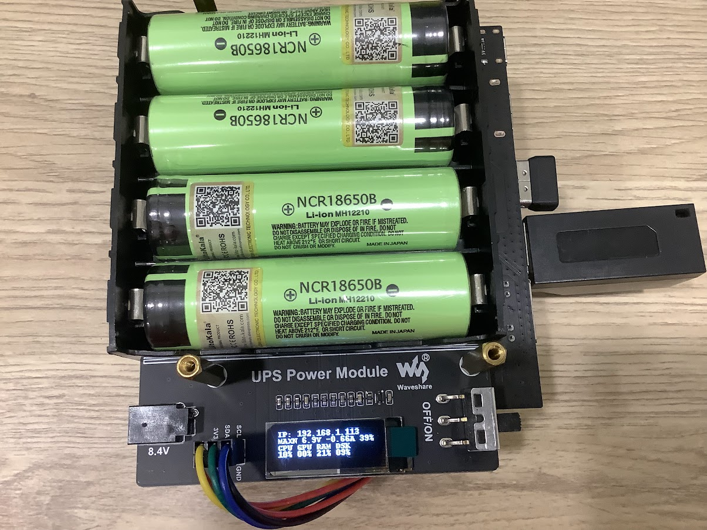

# Jetson Nano UPS

Jetson Nano 需要的電源電流比較大，網路上看到不少項目是用行動電源，我買了一塊 Jetson Nano UPS

硬體的安裝就參考官方的 [wiki](https://www.waveshare.net/wiki/UPS_Power_Module)，我沒有遇到什麼問題

板子上有 0.91 吋的螢幕可以用來顯示電池跟系統的資訊，但需要安裝軟體

```
git clone https://github.com/waveshare/UPS-Power-Module
cd UPS-Power-Module
./install.sh <password>
```

會遇到一些錯誤

SyntaxError: future feature annotations is not defined

參考[這篇](https://stackoverflow.com/a/70515215)，Jetson Nano 預設裝的 python 是 3.6 版，但這個需要 3.7 以上

於是我就在把系統多裝一個 3.8

```
sudo apt install python3.8 python3.8-dev
```

那我要讓這套程式使用版本，把 install.sh 中的 python3 執行的地方改成 python3.8

```
echo $password | sudo -S python3.8 setup.py install

python3.8 -m ups_display.create_display_service
```

UPS-Power-Module/ups_display/create_display_service.py
```
ExecStart=/bin/sh -c "python3.8 -m ups_display.display_server"
```

安裝相依套件的部分也要改
```
python3.8 -m pip install Pillow flask smbus --upgrade
```

另外我用的 Jetson Nano 是 2GB 版本，沒有 INA 晶片，所以程式會出錯，參考自[這篇](https://forums.developer.nvidia.com/t/error2-file-or-directory-not-found-6-0040-waveshare-ups-power-module/214508/11)

官方也有寫 [Jetson Nano 2GB does not have an INA3221 power monitor.](https://docs.nvidia.com/jetson/archives/l4t-archived/l4t-325/index.html#page/Tegra%20Linux%20Driver%20Package%20Development%20Guide/power_management_nano.html#wwpID0E0QP0HA)

把 display_server.py 中用到 power_usage 的地方拿掉

再安裝一次就有了


