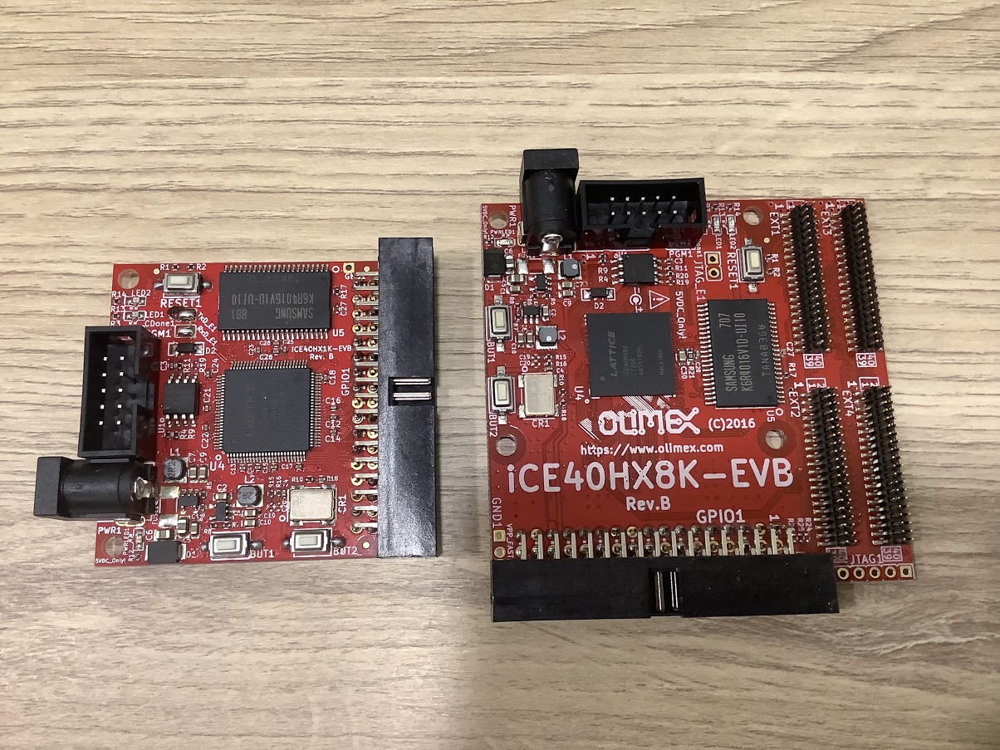
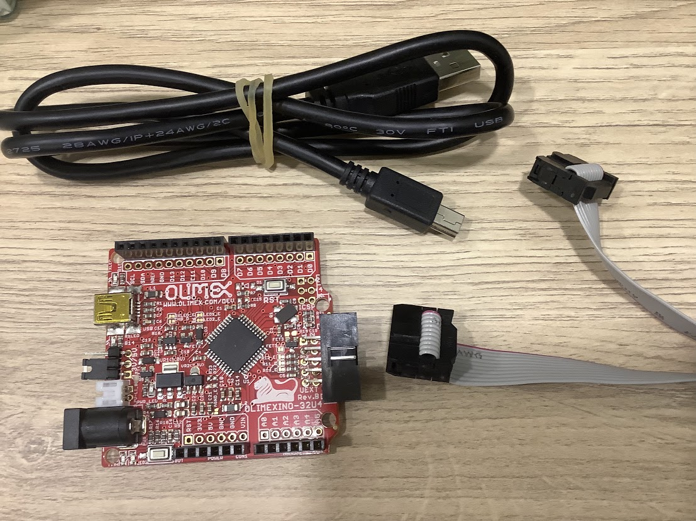
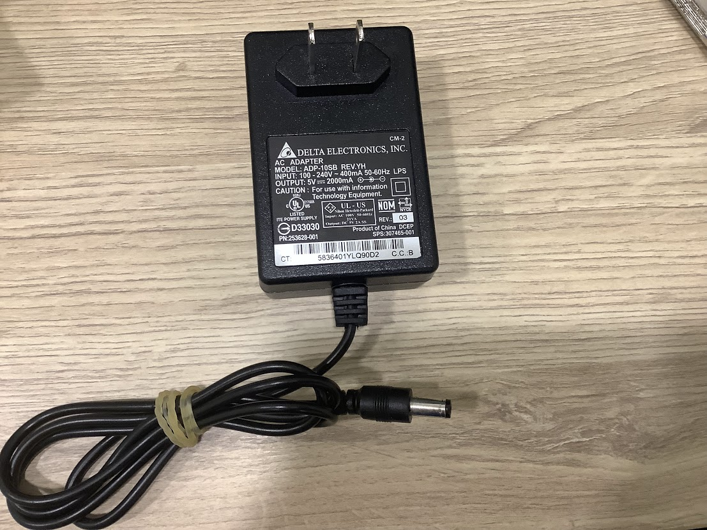
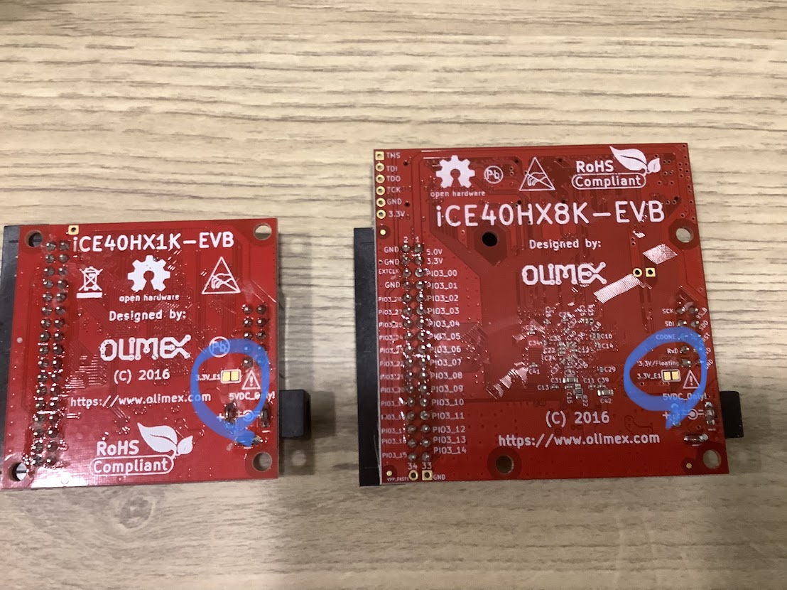
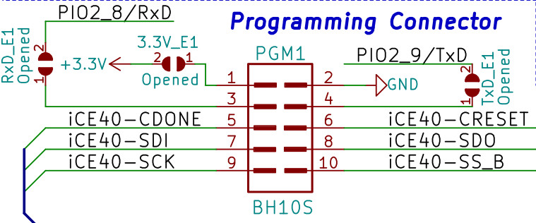
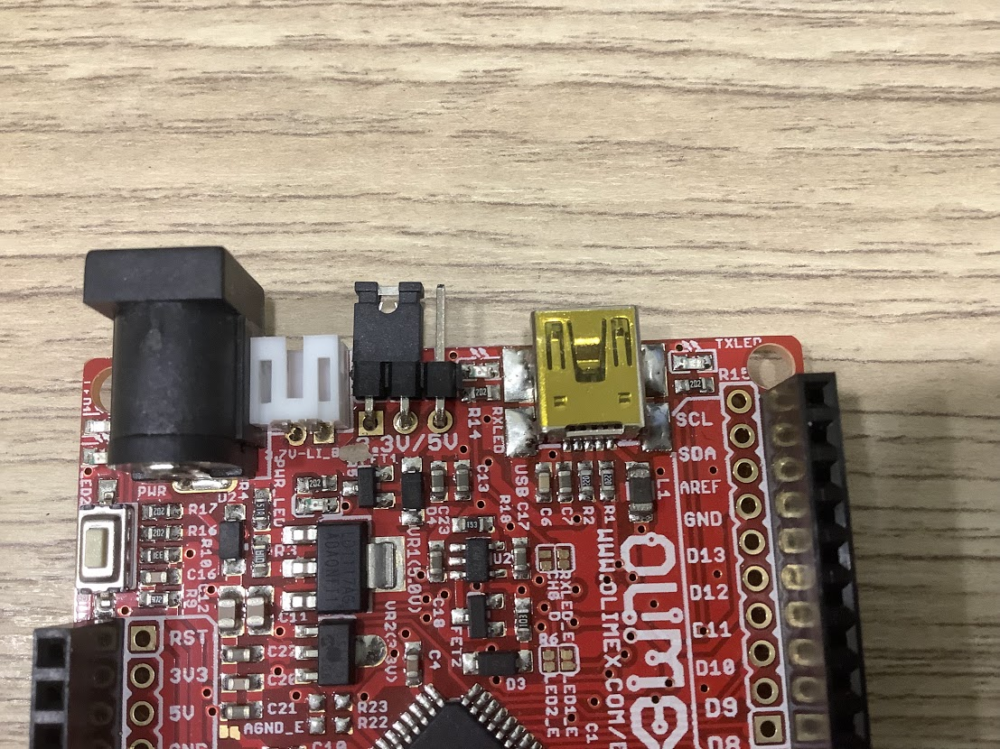

# 準備開發環境

## 硬體

### FPGA

我買了 
[iCE40HX1K-EVB](https://www.olimex.com/Products/FPGA/iCE40/iCE40HX1K-EVB/open-source-hardware) 和
[iCE40HX8K-EVB](https://www.olimex.com/Products/FPGA/iCE40/iCE40HX8K-EVB/open-source-hardware)



以下的步驟是針對 iCE40HX8K-EVB，不過只要改 pcf 檔案就能跑在 iCE40HX1K-EVB 上

### Programmer

Olimex 的[教學文件](https://www.olimex.com/wiki/ICE40HX1K-EVB#Get_started_under_Linux)是用他們出的 
[OLIMEXINO-32U4](https://www.olimex.com/Products/Duino/AVR/OLIMEXINO-32U4/open-source-hardware) 作為燒錄器，跟 FPGA 之間透過 SPI 把要燒錄的內容從電腦傳給 FPGA 開發板



### 5V power supply adapter

手邊剛好有 5VDC 輸出，插孔也對的上就拿來用了，這個是用來給 FPGA 開發板供電，燒錄器會透過電腦的 USB 供電，不用另外供電了，如果要保護電腦的 USB 座，可以買 USB-ISO(USB 隔離器)



FPGA 開發板上有一個小巧思



參考官方的 iCE40HX8K-EVB programming connector



這些接口會跟燒錄器接在一起，如果把背面的 3.3V_E1 的兩個 pad 焊接連在一起，就可以連到燒錄器的 3.3V，這也提醒了燒錄器提供的是 3.3V
可以看一下 OLIMEXINO-32U4 是有提供配置 3.3V 跟 5V 的，記得要確認是 3.3V

這樣做可以不用另外幫 FPGA 板子供電，但等於是電腦 USB 在供電，有 USB 隔離器再這樣做會比較安全

不過 iCE40HX8K-EVB 板子上我找不到 TxD_E1 跟 RxD_E1，iCE40HX1K-EVB 板子上有



#### 附上 Olimex 的建議清單

- iCE40HX1K-EVB or iCE40HX8K-EVB
- 3.3V programmer board - OLIMEXINO-32U4 (customers have reported success using other Arduino compatible boards; and also RPi2, RPiB2+, RPi3, RPiB3+ - we have no first-hand experience with anything else than OLIMEXINNO-32U4)
- IDC10-15cm cable to connect iCE40HX1K-EVB with OLIMEXINO-32U4
- SY0605E 5V power supply adapter
- USB-MINI cable
- optional but recommended USB-ISO

## 軟體

參考 [icestorm](https://clifford.at/icestorm) 就可以了解要使用 iCE40 FPGAs 需要哪些軟體

先看 hello world 的產生流程

```
yosys -p "synth_ice40 -blif rot.blif" rot.v
arachne-pnr -d 1k -p rot.pcf rot.blif -o rot.asc
icepack rot.asc rot.bin
iceprog rot.bin
```

如果還要有簡單的  timing analysis report
```
icetime -tmd hx8k rot.asc
```

我已經準備好一個 ubuntu 20.04 的 VM，需要進到裡面把這些軟體裝起來

### 安裝 prerequisites

```
sudo apt-get install build-essential clang bison flex libreadline-dev \
                     gawk tcl-dev libffi-dev git mercurial graphviz   \
                     xdot pkg-config python python3 libftdi-dev \
                     qt5-default python3-dev libboost-all-dev cmake libeigen3-dev
```

這些工具會被裝到 /usr/local 下

### 安裝 IceStorm Tools (icepack, icebox, iceprog, icetime, chip databases)

```
git clone https://github.com/YosysHQ/icestorm.git ~/icestorm
cd ~/icestorm
make -j$(nproc)
sudo make install
```

### 安裝 Arachne-PNR (place&route tool, predecessor to NextPNR)

```
git clone https://github.com/cseed/arachne-pnr.git ~/arachne-pnr
cd ~/arachne-pnr
make -j$(nproc)
sudo make install
```

### 安裝 NextPNR (place&route tool, Arachne-PNR replacement)

```
git clone https://github.com/YosysHQ/nextpnr ~/nextpnr
cd ~/nextpnr
cmake -DARCH=ice40 -DCMAKE_INSTALL_PREFIX=/usr/local .
make -j$(nproc)
sudo make install
```

### 安裝 Yosys (Verilog synthesis)

```
git clone https://github.com/YosysHQ/yosys.git ~/yosys
cd ~/yosys
make -j$(nproc)
sudo make install
```

> Both place and route tools (Arachne-PNR & NextPNR) convert the IceStorm text chip databases into the respective PNR binary chip databases during build. Always rebuild the PNR tools after updating your IceStorm installation.

### 把 OLIMEXINO-32U4 作為燒錄器

參考[Olimex 的教學](https://www.olimex.com/wiki/ICE40HX1K-EVB#Get_started_under_Linux:~:text=com/YosysHQ/nextpnr-,Preparing%20OLIMEXINO%2D32U4%20as%20programmer,-Download%20latest%20Arduino)

#### 上傳韌體到 OLIMEXINO-32u4

參考[Olimex 的教學](https://github.com/OLIMEX/iCE40HX1K-EVB/tree/master/programmer/olimexino-32u4%20firmware)

我是用 Arduino IDE，目前版本是 2.0.4

把 repo 下載下來，把 programmer/olimexino-32u4 firmware/iceprog.ino 複製到 programmer/olimexino-32u4 firmware/iceprog 資料夾中

然後執行 iceprog.ino，Arduino IDE 會開啟這個資料夾中的四個檔案

OLIMEXINO-32U4 用 mini usb 線接到電腦

板子選擇 Arduino Leonardo

Port 選擇 xxx (Arduino Leonardo)

這個韌體依賴 SPIMemory 套件，檔案也已經在這個資料夾，所以不用另外安裝

編譯跟上傳到板子上

可以先編譯跟上傳 [Olimex 提供的 blink 範例](https://www.olimex.com/Products/Duino/AVR/OLIMEXINO-32U4/resources/Shipping_Blink_Example.zip)

會看到兩顆 LED 輪流閃爍

接著編譯跟上傳 iceprog.ino

iceprog.cpp 出錯，這個檔案只引入 iceprog.ino，我把這檔案刪除，再試一次就可以了

目前只看到出來上傳成功，也就是燒錄器的韌體已經安裝到板子上了

所以現在 OLIMEXINO-32U4 已經可以作為 iCE40HX8K-EVB 的燒錄器了

#### 硬體接線

先確認 OLIMEXINO-32U4 的配置是 3.3V

如果你是用其他板子就要注意電壓是不是 3.3V

OLIMEXINO-32U4 跟 iCE40HX8K-EVB 用 10-pin 的 UEXT 線接起來

#### 使用 iceprogduino

電腦端會執行 iceprogduino 這個程式把燒錄的內容傳給燒錄器(OLIMEXINO-32U4)

燒錄器透過 SPI 上傳到 FPGA 板子上  

從 programmer 資料夾中可以找到 iceprogduino 

```
cd iceprogduino
make clean
make
make install
```

#### 上傳 Hello World

可以直接拿 Olimex 針對 iCE40HX8K-EVB 提供的[範例](https://github.com/OLIMEX/iCE40HX8K-EVB/tree/master/demo/ice40hx8k-evb)

把燒錄器跟 iCE40HX8K-EVB 接上，記得供電

因為我是在 VM 中操作，所以需要把 VirtualBox 中的 Devices/USB/xxx Arduino Leonardo 選上

參考 Makefile 中的命令

```
yosys -p 'synth_ice40 -top top -blif example.blif' example.v
arachne-pnr -d 8k -p ice40hx8k-evb.pcf example.blif -o example.asc
icepack example.asc example.bin
sudo iceprogduino example.bin
```

可以看到除了燒錄的部分跟 icestorm 的流程不一樣，其他都一樣
