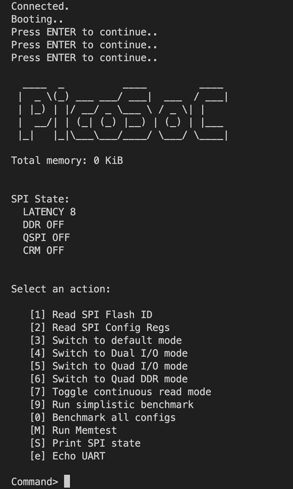

# hello-picosoc

最近在看 [Caravel Harness](https://github.com/efabless/caravel)，這個 SoC 的核心是使用 RISC-V CPU，RISC-V 是一個基於精簡指令集(RISC)原則的開源指令集架構(ISA)，根據[介紹](https://caravel-docs.readthedocs.io/en/wavedrom-regs/index.html) Caravel 是使用 PicoRV32，[PicoRV32](https://github.com/YosysHQ/picorv32) 項目中提供了 SoC 範例，並且提供兩個 FPGA 開發板的範例，雖然開發板跟我手邊有的不一樣，但其中一個使用的 FPGA 晶片 iCE40-HX8K 是相同的，因此我想嘗試將 PicoSoC 跑在開發板上

## 開發環境

我手邊有的開發板是 [iCE40HX8K-EVB](https://www.olimex.com/Products/FPGA/iCE40/iCE40HX8K-EVB/open-source-hardware)，搭配 [OLIMEXINO-32U4](https://www.olimex.com/Products/Duino/AVR/OLIMEXINO-32U4/open-source-hardware) 作為燒錄器，開發使用的作業系統是 macOS

## 關於 PicoSoC

項目提供了支援 FPGA 開發板所需的檔案，分別是 iCE40-HX8K Breakout Board 和 iCEBreaker，前者是 Lattice 公司出的開發板，因為跟 Olimex iCE40HX8K-EVB 用的是同一個 FPGA 晶片 HX8K，主要會參考 HX8K 相關的檔案

根據 PicoSoc 的文件，需要

1. 模擬: `make hx8ksim`
2. 產出檔案並上傳到開發板: `make hx8kprog`

## 安裝軟體

從 picorv32/picosoc/Makefile 就可以找到這兩個命令，需要的軟體如下

- RISC-V toolchain: 用來編譯 firmware(安裝64位元的 toolchain 就會包含32位元的)
- iverilog、vvp(包含在 iverilog): 模擬
- yosys: 合成電路
- nextpnr-ice40: place and route
- icetime(包含在 [icestorm](https://clifford.at/icestorm#:~:text=What%20are%20the%20IceStorm%20Tools%3F)): timing analysis
- icepack(包含在 [icestorm](https://clifford.at/icestorm#:~:text=What%20are%20the%20IceStorm%20Tools%3F)): convert ASCII file back to an iCE40 .bin file
- IceProg: driver program(我沒有使用這個，因為 iCE40HX8K-EVB 會搭配一個燒錄器跟 iceprogduino)

## 實驗

我 [Forked 了一份](https://github.com/xralphack/picorv32)用於記錄我所做的修改，以下僅列出結論

### 1. 模擬

模擬不會依賴開發板，所以直接執行 `make hx8ksim` 是可以看到結果的

```verilog
00000000
00000001
+50000 cycles
00000011
00000111
00001111
00011111
Serial data: 224
Serial data: 247
Serial data: 247
Serial data: 250
Serial data: 245
Serial data: 246
+50000 cycles
Serial data: 243
Serial data: 214
Serial data: 214
Serial data: 'G'
00111111
Serial data: 241
+50000 cycles
01111111
11111111
```

### 2. 產出檔案並上傳到開發板

- 需要參考 iCE40HX8K-EVB schematic 從而修改 hx8kdemo.pcf
- 開發板上的時鐘頻率是 100 MHz，需要修改 icetime 命令的參數，會看到檢查不會通過
    
    ```
    icetime -d hx8k -c 100 -mtr olimex_hx8kdemo.rpt olimex_hx8kdemo.asc
    // Reading input .asc file..
    // Reading 8k chipdb file..
    // Creating timing netlist..
    // Timing estimate: 26.07 ns (38.36 MHz)
    // Checking 10.00 ns (100.00 MHz) clock constraint: FAILED.
    make: *** [olimex_hx8kdemo.bin] Error 1
    ```
    
- 根據 nextpnr 的[文件](https://github.com/YosysHQ/nextpnr/blob/master/docs/constraints.md#clock-constraints)，可以指定 —freq 設定時鐘頻率
- 參考[這篇教學](https://github.com/Obijuan/open-fpga-verilog-tutorial/wiki/Cap%C3%ADtulo-15%3A-Divisor-de-frecuencias)，用一個 divider 把 100 MHz 降成 10 MHz，就可以通過了
    
    ```
    icetime -d hx8k -c 10 -mtr olimex_hx8kdemo.rpt olimex_hx8kdemo.asc
    // Reading input .asc file..
    // Reading 8k chipdb file..
    // Creating timing netlist..
    // Timing estimate: 27.16 ns (36.82 MHz)
    // Checking 100.00 ns (10.00 MHz) clock constraint: PASSED.
    icepack olimex_hx8kdemo.asc olimex_hx8kdemo.bin
    ```
    
- 把 IceProg 相關的命令換成 iceprogduino，上傳到開發板
- 用 `sudo cu -s 115200 -l /dev/cu.usbmodem14301` 看 uart 傳過來的資訊(輸入 ~. 加上 Enter 可以關閉)，結果都是亂碼，我猜是因為時鐘頻率改變所以 uart 的 baud rate 也改變了，從 firmware.c 中找到 `reg_uart_clkdiv = 104;` 104 是因為本來的時鐘頻率是 12e6，所以除以104能接近 115200，現在的時鐘頻率是 10e6，所以把這個值改成 86，就成功了
    
    
    
- 再執行一次模擬會有問題，應該是因為時鐘頻率被降10倍，所以 test bench 要修改，我沒有理解為什麼 `localparam ser_half_period = 53;` 加上我對於 Verilog 也一知半解，所以我用猜的去改一些時間相關的值，最後看到輸出了跟先前一樣的結果^ ^